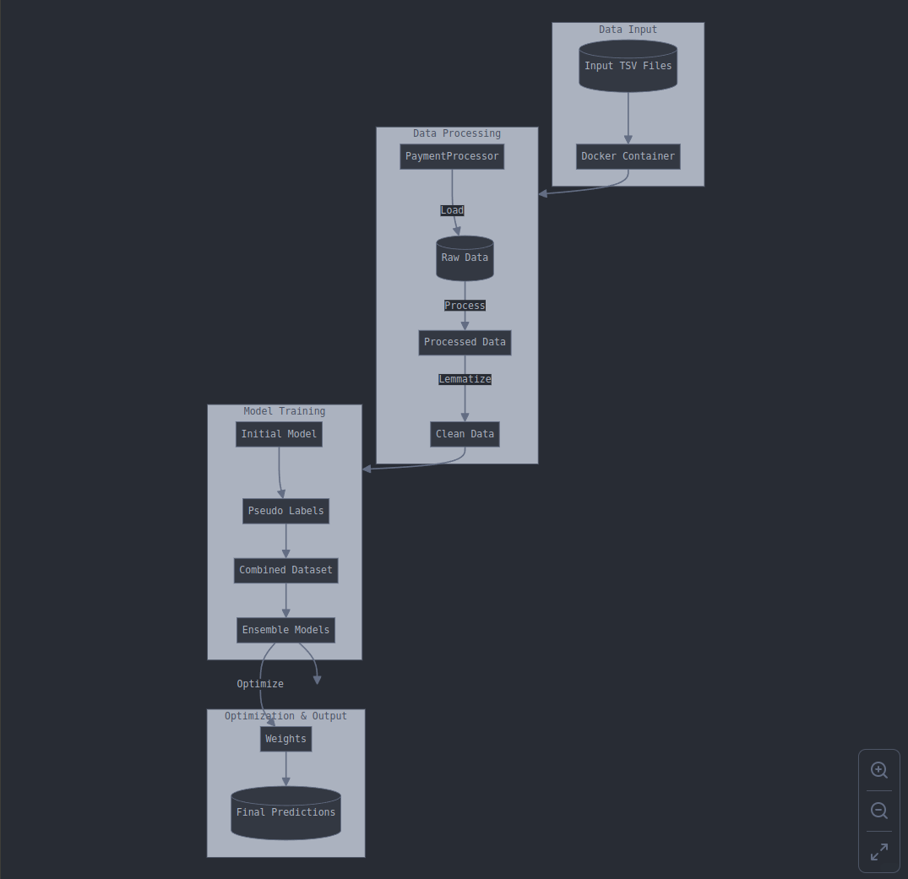

# BIV Hack Challenge: Автоматизация разбора платежей  
**Команда**: Команда 10  

## Описание проекта  
Этот проект направлен на автоматизацию разбора платежей с использованием методов обработки текстов, полуобучения (semi-supervised learning) и ансамблевого обучения. Основной скрипт `predict.py` запускается внутри Docker-контейнера, загружает данные, обрабатывает их, выполняет предсказания с помощью ансамбля моделей и сохраняет результаты.

---

### 👷⚙️🌳 Архитектура проекта


## Основные компоненты решения  

### **Обработка данных**  
1. **Многоуровневая очистка текста**:  
   - Удаление URL, email, чисел, спецсимволов.  
   - Фильтрация по кириллице.  
   - Удаление стоп-слов с учетом морфологических особенностей русского языка (Natasha, pymorphy2).  
   - Нормализация сокращений (например, "гос." -> "государственный").  

2. **Лемматизация текста**:  
   - Используются библиотеки Natasha и pymorphy2.  
   - Учет морфологических тегов для исключения несущественных частей речи.  

3. **Подготовка данных для моделей**:  
   - Лемматизированные описания хранятся в отдельном столбце `lemmed_opisanie`.  

### **Модели и обучение**  
1. **Начальное обучение**:  
   - Используются размеченные данные для начальной модели.  
2. **Semi-supervised Learning**:  
   - Псевдо-метки создаются на основе уверенных предсказаний модели на неразмеченных данных.  
3. **Ансамбль моделей**:  
   - Пять моделей CatBoost обучаются с кросс-валидацией.  
   - Оптимизация весов ансамбля на основе F1-метрики.  

### **Контейнеризация**  
- Код упакован в Docker-контейнер, обеспечивая независимость от внешних зависимостей.  

---

## Преимущества подхода  
1. **Качество обработки текста**:  
   - Учитываются морфологические особенности русского языка.  
   - Комплексная очистка и нормализация данных.  

2. **Надежность и масштабируемость**:  
   - Ансамбль моделей повышает устойчивость предсказаний.  
   - Кросс-валидация минимизирует риск переобучения.  
   - Модульная структура кода упрощает добавление новых компонентов.  

3. **Полуобучение**:  
   - Эффективное использование неразмеченных данных повышает точность модели.  

---

## Инструкция по запуску  

1. **Входные данные**:
   В папке ./data/ должен находиться файл **payments_main.tsv** с данными для обработки.
2. **Сборка Docker-образа**:  
   Выполните команду:  
   ```bash
   docker build -t my_project_image .
   ```
3. Запуск контейнера:
   Запустите контейнер с моделью:
   ```bash
   sudo docker run -v "/$(pwd)/data:/app/data" -v "/$(pwd)/predictions:/app/predictions" --rm -m 8g my_project_image
   ```
4. Результаты:
   ```bash
   Предсказания сохраняются в файл ./predictions/predict.tsv.
   ```
